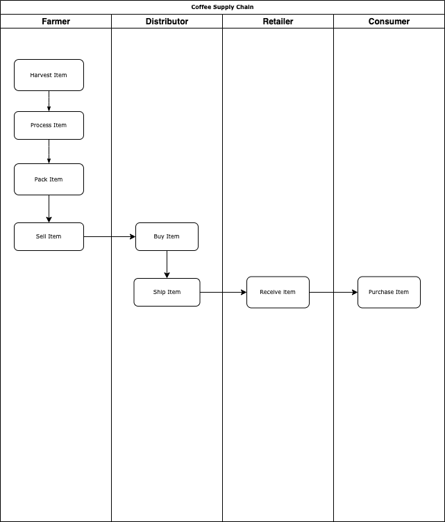
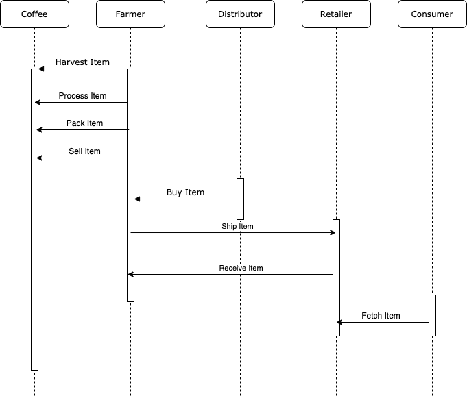
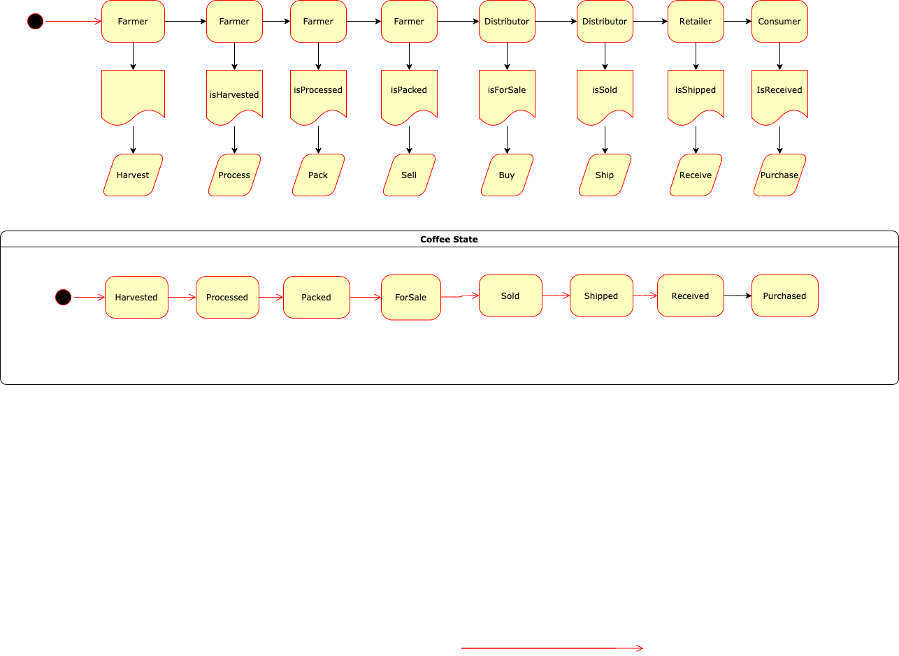
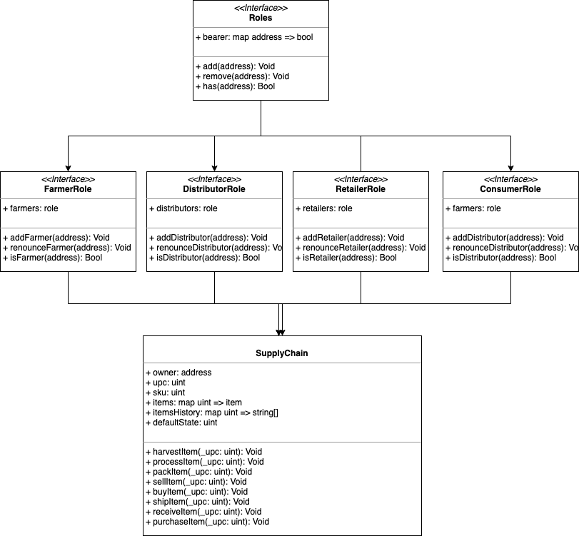

# Project Writeup

## General

### Contract Address
Rinkeby-Contract-Address: [0x3D5DaDB0973cDFC249eA6a0534CbBf76dBC40EB5](https://rinkeby.etherscan.io/address/0x3D5DaDB0973cDFC249eA6a0534CbBf76dBC40EB5)

### Steps / Setup
I had to do a few changes to the general setup to make the starter code for the frontend application work:
1. Add `web3.min.js` file to the src/js directory
2. Import `truffle-contract` directly using `require` instead of using the provided `truffle-contract.js` which did not work.
3. To be able to use `require` I had to bundle my code using [broswerfy](http://browserify.org/) and source the bundled `src/js/bundle.js` instead of `app.js` directly.

With the above changes I was able to call all of the contract functions from the browser

### Versions
Truffle: v4.1.14 (core: 4.1.14)
Solidity: v0.4.24 (solc-js)
Node: v15.10.0
NPM: 7.5.3
Web3: 0.20.6

## IPFS
I did not use IPFS.

## UML
Below are the UML graphs that I created using drawio. You can find png / xml representations of these graphs in `project-6/uml`

### Activity

### Sequence

### State

### Class

